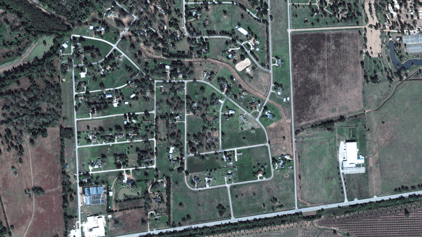

<h1 align="center">Welcome to Hurricane Damage Detection </h1>

  

> The research project aims at estimating housing damages from hurricanes such as Hurricane Harvey, Hurricane Katrina, etc. by using Siamese Networks on top of satellite imagery. The objective is to help in fast-forwarding insurance claims and ensure their legitimacy.

## Project Statement
The project focusses on estimating damages done to houses by estimating buildings before and after the disaster and analyzing the differences between the two. This is contingent on the fact that geo-referenced imagery for regions, both prior to the disaster when the buildings are in tact, and right after the disaster occurred, damaging properties, roads, trees, etc., are available. There also needs to be labelled data available for previous disasters, indicating the level of damages incurred by houses.  Machine learning techniques such as Convolution Neural Networks (CNNs) have shown tremendous progress for similar tasks in recent years. Although they do require significant amounts of data to work, the accuracy level achieved, combined with their generalizability across multiple terrains and geographical regions make them a suitable choice for this task.

The scope of this project is limited to property damages, but can be extended to roads, trees and water bodies.

## Author

👤 **Tatyana Deryugina, Shubham Goel**

* Website: https://economics.illinois.edu/profile/deryugin, https://shubhamgoel27.github.io
* Github: [@shubhamgoel27](https://github.com/shubhamgoel27)

## Show your support

Give a ⭐️ if this project helped you!

***
_This README was generated with ❤️ by [readme-md-generator](https://github.com/kefranabg/readme-md-generator)_